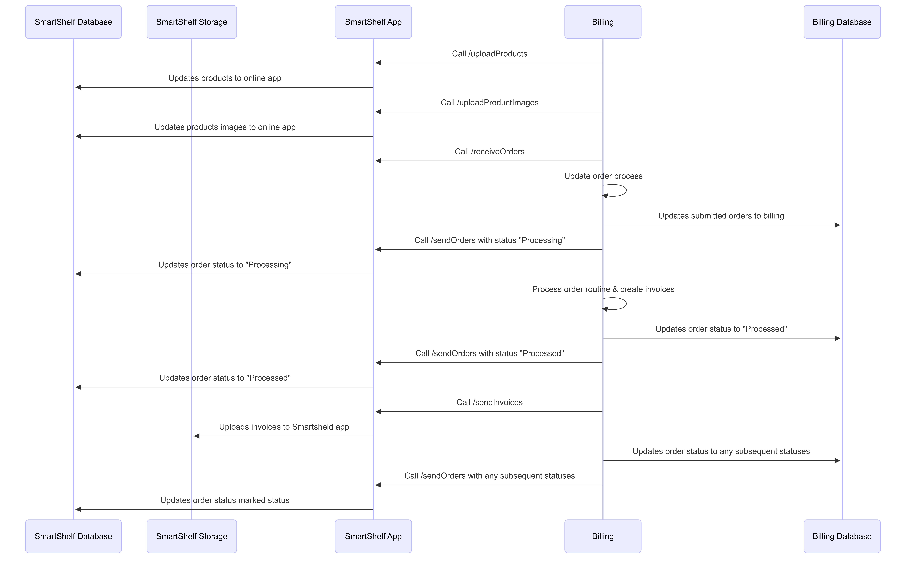

# SmartShelf API Documentation (Third‑Party Integration)

This sequence diagram illustrates a comprehensive synchronization and order fulfillment workflow between the **Billing system** and the **SmartShelf ecosystem** (comprising the App, Database, and Storage).

### **Workflow Summary**

The process begins with the **Billing system** populating the **SmartShelf App** by triggering the `/uploadProducts` and `/uploadProductImages` endpoints, which ensures the **SmartShelf Database** is up-to-date with current inventory. Once the initial data is synced, the Billing system retrieves orders via the `/receiveOrders` call, subsequently updating its internal **Billing Database** with the submitted order details.

As the order moves through its lifecycle, the Billing system maintains a tight feedback loop with the App: it first sets the status to **"Processing"** and later to **"Processed"** after finishing its internal routines and invoice generation. During this phase, invoices are sent to the App and archived in **SmartShelf Storage**. Finally, the workflow concludes with the Billing system communicating any subsequent status updates to the SmartShelf App, ensuring both databases remain perfectly synchronized regarding the final state of the order.

------

### **Key Technical Milestones**

- **Data Provisioning:** Products and images are pushed from Billing to the SmartShelf DB via the App API.
- **Order Intake:** Billing pulls orders and synchronizes its local Billing DB first.
- **Status Orchestration:** A two-way synchronization ensures "Processing" and "Processed" states are reflected in both the Billing and SmartShelf databases.
- **Document Management:** Invoices generated by the Billing system are offloaded to **SmartShelf Storage** for persistent access.
- **Lifecycle Maintenance:** Subsequent order statuses are continuously synced to keep the SmartShelf App updated.

<!-- Use a responsive image so the diagram fits the page -->

  

## APIs

- [Upload Products](./upload-products.md) — Instructions and sample payloads for uploading product data (CSV or JSON), field mappings, validation rules, and common errors.
- [Upload Product Images](./upload-product-images.md) — Guide for uploading product images using multipart/form-data, naming conventions, and size/format requirements.
- [Receive Orders](./receive-orders.md) — Details on pulling orders from **SmartShelf** (GET endpoints), pagination, filters, and sample responses.
- [Send Orders](./send-orders.md) — Steps and examples for pushing orders into **SmartShelf** (POST), required headers, idempotency notes, and error handling.
- [Send Invoices](./upload-invoices.md) — How to upload invoice PDF files (multipart), expected metadata, and downstream processing behavior.

Integration notes
- Request application administrator for endpoint url, API keys and token details.
- All requests require authentication. Include an Authorization header with a bearer token (or as specified by your agreement).
- Many endpoints expect an encrypted key header (named `key`) — see each doc for details.
- For file uploads, use multipart/form-data with proper Content-Type boundaries.
- For downloads, the API returns Content-Type: application/pdf and Content-Disposition: attachment.

If you need a machine-readable OpenAPI (Swagger) file, request it from the API owner.
