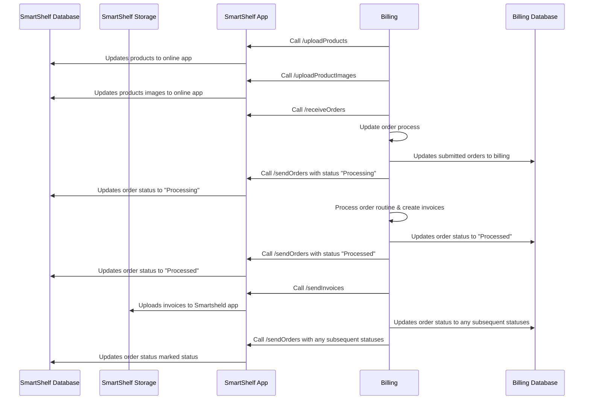

# SmartShelf API Documentation (Third‑Party Integration)

This document contains integration guides for the public APIs exposed by **SmartShelf**  online application. Each document includes endpoint details, required headers, sample requests (curl), example responses, and integration notes.

## Integration flow

Below is a high-level sequence diagram that shows authentication and how a third‑party system interacts with Smartshelf online application endpoints.

## APIs

- [Upload Products](./upload-products.md) — Instructions and sample payloads for uploading product data (CSV or JSON), field mappings, validation rules, and common errors.
- [Upload Product Images](./upload-product-images.md) — Guide for uploading product images using multipart/form-data, naming conventions, and size/format requirements.
- [Receive Orders](./receive-orders.md) — Details on pulling orders from RetailProcessor (GET endpoints), pagination, filters, and sample responses.
- [Send Orders](./send-orders.md) — Steps and examples for pushing orders into RetailProcessor (POST), required headers, idempotency notes, and error handling.
- [Send Invoices](./upload-invoices.md) — How to upload invoice PDF files (multipart), expected metadata, and downstream processing behavior.

Integration notes
- Request application administrator for endpoint url, API keys and token details.
- All requests require authentication. Include an Authorization header with a bearer token (or as specified by your agreement).
- Many endpoints expect an encrypted key header (named `key`) — see each doc for details.
- For file uploads, use multipart/form-data with proper Content-Type boundaries.
- For downloads, the API returns Content-Type: application/pdf and Content-Disposition: attachment.

If you need a machine-readable OpenAPI (Swagger) file, request it from the API owner.
